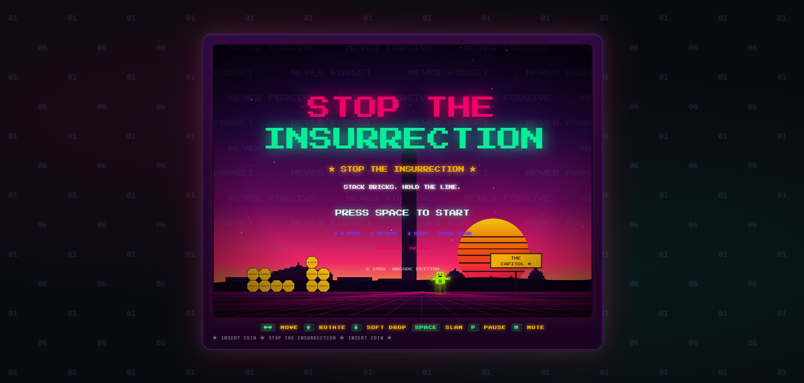
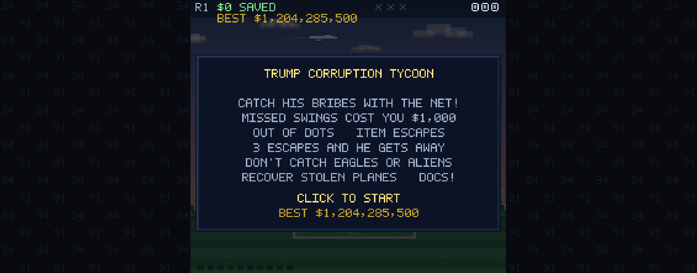
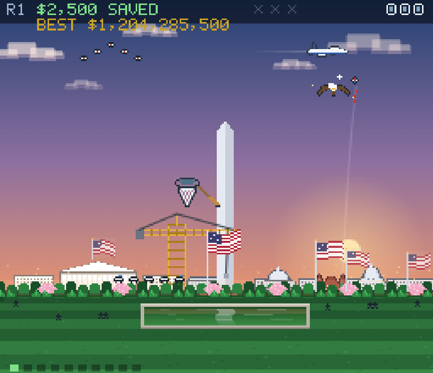

# whitehouse games

The White House put a set of shit propaganda games on arcade.gov. This repo has both: the originals, rebuilt and preserved, and anti-fascist remixes that flip each game's message around.

I'm not a game maker. But the bar the White House set is on the floor, and anything I make has to be better than the shit they made. That's the whole project: take their shit and make it less shit, and counter the message while I'm at it.

## wh-arcade/ — The Originals

Reverse-engineered and rebuilt copies of all five arcade.gov games, kept in their original state as documentation of what they shipped. See [wh-arcade/README.md](wh-arcade/README.md) for the capture details, verification notes, and rights (17 U.S.C. § 105 — no copyright in U.S. Government works, so it's free to mirror and mod).

## anti-fascist games/ — The Mods

The same games with the message flipped into protest games.

### Stop the Insurrection (mod of Build the Wall)

Defend the Capitol from a wave of insurrectionists instead of building the wall.

- Block-stacking defense built from the 12 classic pentominoes (F, I, L, N, P, T, U, V, W, X, Y, Z) on a 15-column board.
- Clear groups of 3+ matching colors instead of full lines.
- Traitors march along the bottom; when one dies on a column it eats your barricade from below, triggering cascades.
- The D.C. skyline backdrop is lifted straight from the Tycoon game (same skyline, same buildings).
- "NEVER FORGET / NEVER FORGIVE" scrolls across the sky, the HUD counts TRAITORS, and the page background is tiled with "01 06" — the date, not a version number.

### Trump Corruption Tycoon (mod of Trump Savings Tycoon)

Catch his bribes with a giant net before they escape. Missed swings cost $1,000, three escapes and he gets away. Extras: recover Air Force One and Marine One, dodge the alien penalty, catch the golden hamburger, and click the reflecting pool for a free joke (MAGA — Make Algae Great Again). All the specials live in one config table in the code.

### Perp Walk (mod of Rio Run)

Snake-style warrant service: round up the whole administration along the line — staffers, Vance, Miller, Noem, Hegseth, Patel, and Trump himself (the biggest fish). Noem chases a dog around the board while you play.

### Flappy Bill

Keep the bill in the air while flying through monuments.

### Supply Line

Food-safety conveyor satire: bare food rides, treated food comes off. You decide what stays on the line — let it ride, or knock it off.

## Development notes

- Each game lives in three forms: `games/` (as-shipped bundle), `readable/` (beautified source — this is the one to edit), and `standalone/` (self-contained playable HTML).
- There are no build scripts. Edits to `readable/*.js` must be mirrored into `standalone/*.html` by hand.
